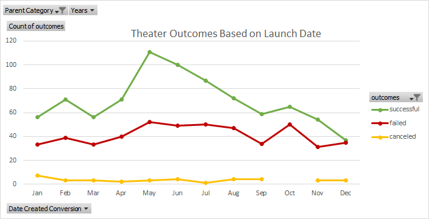
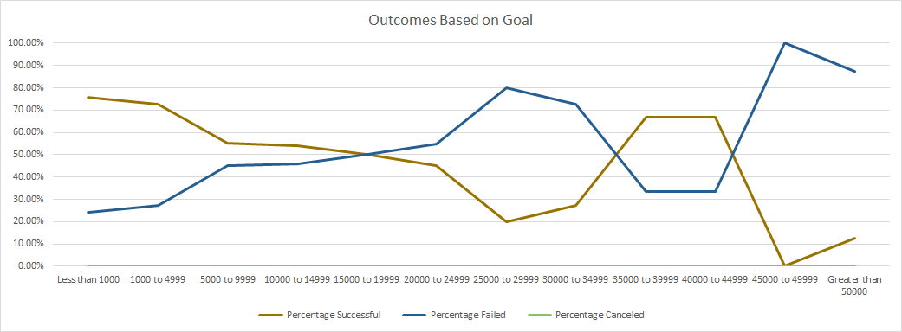
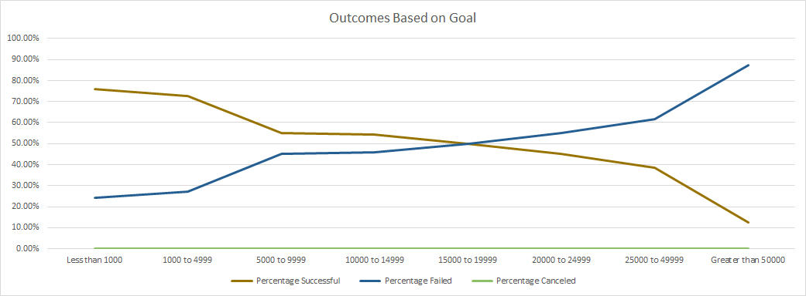

# An Analysis of Kickstarter Campaigns

## Overview of Project

### Performing analysis on Kickstarter data to determine how different campaigns fared in relation to their launch dates and their funding goals

## Analysis and Challenges

### Analysis of Outcomes Based on Launch Date
- Organized the information of the number of successful, failed, and cancelled outcomes based on their Kickstarter launch date using a pivot table.
- Sorted and examined the newly organized information.
- Filtered the information to look exclusively at theater projects.
- Graphed the findings in a line graph to visualize the total number of each outcome across the timeline.

### Analysis of Outcomes Based on Goals
- Constructed a table to gather and organize the information of the number of successful, failed, and cancelled outcomes based on what funding goals.
- Had the table group the results based on predetermined ranges of their funding goal.
- Had the table filter the data to look exclusively at plays.
- Sorted and examined the newly organized information.
- Calculated the percentage of successful, failed, and cancelled projects accordingly using the newly organized information.
- Graphed the findings into a line chart to visualize the relationship between the goal-amount ranges and the percentage of successful, failed, or canceled projects.

### Challenges and Difficulties Encountered
- Might have had to clean the data to uncover any potential outliers.
- Looked into using a different style of graph to visualize the "Outcomes Based on Goals" findings that may be more suitable than a line graph.

## Results

- What are two conclusions you can draw about the Outcomes based on Launch Date?
  i. Theater Kickstarters which launched between April & August had the most successful outcomes, with a peak for ones that started in May.
  ii. Theater Kickstarters launched in December had a significantly lower success rate than any other time of year.
  

- What can you conclude about the Outcomes based on Goals?
  1. Projects for plays with fundraising goals of under $5,000 had a much higher chance of success.
  2. There is a steady decrease in play projects success rate the higher the funding goal, up to $25,000. 
  3. The sample size of play projects with a fundraising goal higher than $25,000 is much smaller, and may lead the data to look misleading. 
  4. If play projects with fundraising goals between $25,000 - $50,000 were summed up and grouped together to increase the sample size, then we would see it following a more consistent pattern of a steady decrease to the success rate as the funding goal increased.

- What are some limitations of this dataset?
  i. The dataset has a small sample size prior to the year 2014, and for projects with funding goals above $15,000 which makes it more difficult to determine any trends.
  ii. The dataset does not cover the full scope of a project. Presumably projects with fundraising goals of less than $5,000 vs goals of over $50,000 have different desires which perhaps should not be compared to each other.
  iii. The dataset does not take into account any other factors that may have effected the project's outcome, such as environmental or economical conditions at the time of launch.

- What are some other possible tables and/or graphs that we could create?
  	1. A stacked column graph visualize the "Outcomes Based on Goal" findings as opposed to the line graph may be more appropriate.
	2. A theater "Outcomes Based on Launch Date" table & graph based on percentages instead of just total outcomes.
	3. Similar graphs based on other categories besides theater and plays to see if these trends follow across all Kickstarter categories.
