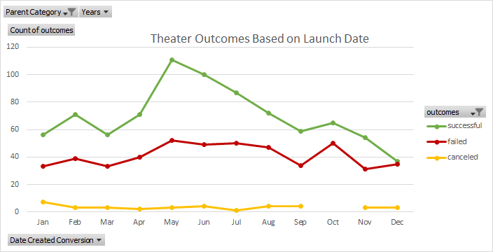
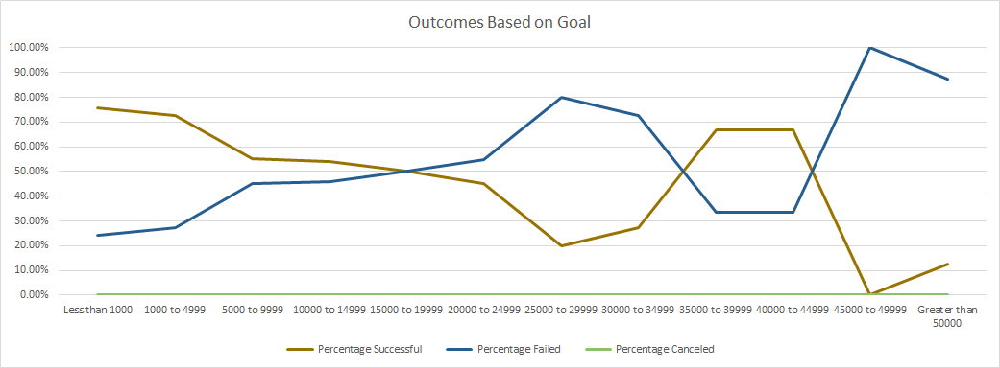

# Kickstarter Campaign Analysis

## Overview of Project

Louise wants to start a crowd funding campaign to help fund her play "Fever". She is estimating a budget of over $10,000, and is understandably hesitant about jumping into her first fund raising campaign. I will be using Excel to organize, sort, and analyze crowd funding data to determine whether there are specific factors that make a project's campaign successful. I will then use these insights to help Louise plan her campaign, and set it up for success. Using Excel to analyze current, and previous kickstarter data, will help her gain a greater understanding of campaigns from start to finish, and will be able to set her campaign to mirror other successful ones in the same category.

## Resources
- Data Source: data-1-1-3-StarterBook.xlsx
- Software: Microsoft Excel 2019

## Tasks Accomplished in this Module:

- Import data into a table for analysis
- Apply filters, conditional formatting, and formulas
- Generate and interpret pivot tables
- Calculate summary statistics such as measures of central tendency, standard deviation, and variance
- Characterize data to identify outliers in datasets
- Perform an Excel analysis with visualizations
- Interpret common Excel visualizations

## Analysis and Challenges

### Analysis of Outcomes Based on Launch Date

I organized the information of the number of successful, failed, and cancelled outcomes based on their Kickstarter launch date using a pivot table. I then sorted and examined the newly organized information, and fiiltered the information to look exclusively at theater projects. I then graphed the findings in a line graph to visualize the total number of each outcome across the timeline.

### Analysis of Outcomes Based on Goals

I constructed a table to gather and organize the information of the number of successful, failed, and cancelled outcomes based on what funding goals. I had the table group the results based on predetermined ranges of their funding goal, and filtered the data to look exclusively at plays by using the COUNTIFS function. I calculated the total projects in each funding goal range using the SUM function. I calculated the percentage of successful, failed, and cancelled projects for each funding goal range accordingly. I then graphed the findings into a line chart to visualize the relationship between the goal amount ranges and the percentage of successful, failed, or canceled projects.

### Challenges and Difficulties Encountered

This data was clean, but I might have had to clean the data to uncover any potential outliers. I also ran into a challenge thinking about other graph styles to visualize the "Outcomes Based on Goals" findings that may be more suitable than a line graph.

## Analysis Results

Based on my findings, we are able to validly answer the following questions:

1. What are two conclusions you can draw about the Outcomes based on Launch Date?
	- Theater Kickstarters which launched between April & August had the most successful outcomes with a peak for ones that started in May.
	- Theater Kickstarters launched in December had a significantly lower success rate than any other time of year.

2. What can you conclude about the Outcomes based on Goals?
	- Projects for plays with fundraising goals of under $5,000 had a much higher chance of success.

3. What are some limitations of this dataset?
	- The dataset has a small sample size prior to the year 2014, and for projects with funding goals above $15,000 which makes it more difficult to determine any trends.
	- The dataset does not cover the full scope of a project. Presumably projects with fundraising goals of less than $5,000 vs goals of over $50,000 have different desires which perhaps should not be compared to each other.
	- The dataset does not take into account any other factors that may have effected the project's outcome, such as environmental or economical conditions at the time of launch.

4. What are some other possible tables and/or graphs that we could create?
  	- A stacked column graph visualize the "Outcomes Based on Goal" findings as opposed to the line graph may be more appropriate.
	- A theater "Outcomes Based on Launch Date" table & graph based on percentages instead of just total outcomes.
	- Similar graphs based on other categories besides theater and plays to see if these trends follow across all Kickstarter categories.